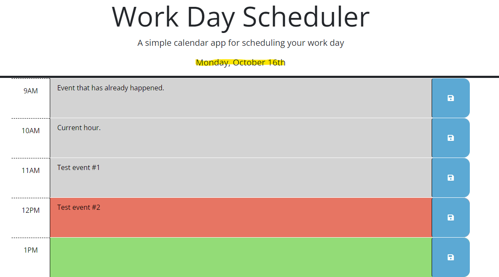
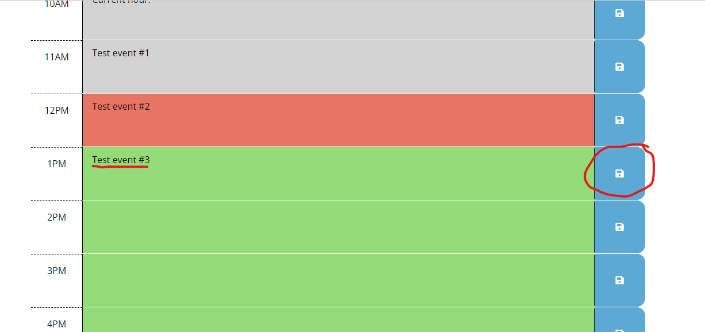

# Work Day Scheduler

Work Day Scheduler is a simple calendar application designed for scheduling your work day. It provides an hourly breakdown for a typical 9AM-5PM work day. Users can input, edit, and save their appointments, tasks, and reminders for each hourly slot. The scheduler also highlights the current hour, showing past hours in gray, the current hour in red, and future hours in green.

## Features

- **Responsive Design**: The application is mobile-responsive, ensuring that you can manage your schedule on the go.
  
- **Local Storage**: Your daily appointments are saved to your browser's local storage. So even if you refresh the page or return later, your inputs remain.
  
- **Dynamic Date & Time Highlighting**: The scheduler always displays the current day at the top and visually distinguishes between past, present, and future time blocks.

## How to Use

1. **View Current Date**: At the top of the scheduler, today's date is displayed in the format `Day, Month Date`.

2. **Adding/Editing an Appointment**:
   - Find the desired time block.
   - Click inside the text area and enter your appointment details.
   - Click the save button (floppy disk icon) to the right of the text area to save the appointment.

3. **Viewing Saved Appointments**: Simply revisit the site or refresh the page. Any saved appointments will be automatically loaded into their respective time blocks.

4. **Understanding the Color Coding**:
   - Gray blocks represent hours that have passed.
   - Red blocks represent the current hour.
   - Green blocks represent upcoming hours.

## Dependencies

The Work Day Scheduler makes use of the following libraries:

- [Bootstrap](https://getbootstrap.com/): For responsive design and styling.
- [FontAwesome](https://fontawesome.com/): For icons, specifically the save icon.
- [Google Fonts](https://fonts.google.com/): Specifically the 'Open Sans' font for typography.
- [jQuery](https://jquery.com/): For easy DOM manipulation and event handling.
- [Day.js](https://day.js.org/): For handling and displaying dates.

## Installation

To install and run this application locally:

1. Clone [this repository](https://github.com/KobayashiKerfuffle/varnas-day-scheduler.git) to your local machine.
2. Open `index.html` in your preferred browser.

## Contribution

If you'd like to contribute, please fork the repository and use a feature branch. Pull requests are warmly welcome.

## Licensing

The code in this project is licensed under MIT license.

## Acknowledgements

Thanks to Bootstrap, FontAwesome, Google Fonts, jQuery, and Day.js for making this application possible.
